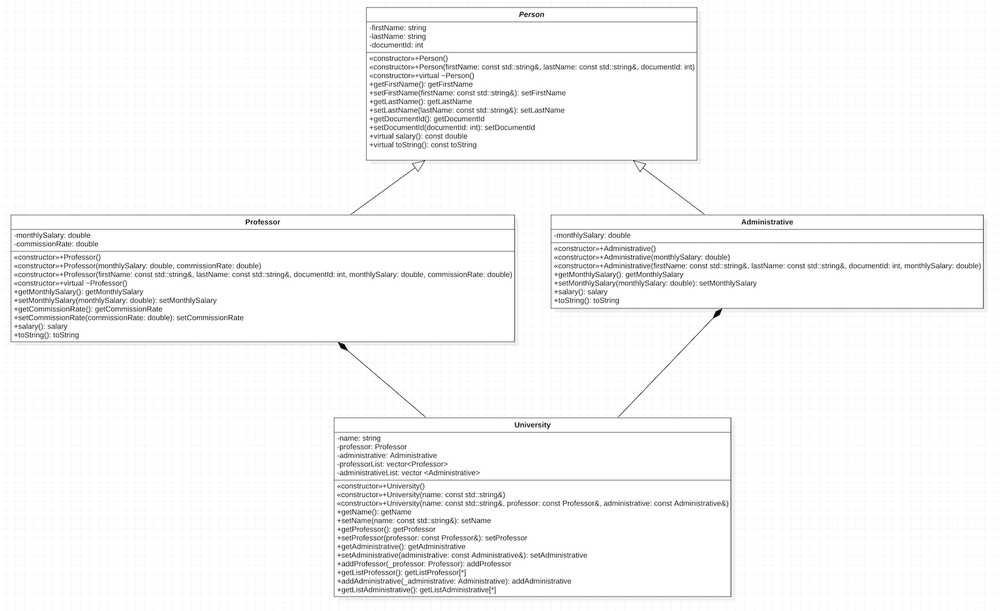
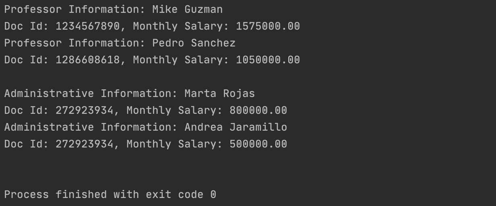

# Lab02-OOP

The following is the laboratory of Object Oriented Programming. 

Topics to evaluate in this laboratory:

- Polymorphism
- Inheritance
- Relationship
- Templates

## UML Class Diagram

- The following class diagram were created using http://staruml.io/

## Output expected

- The output of the Main.cpp should be:

